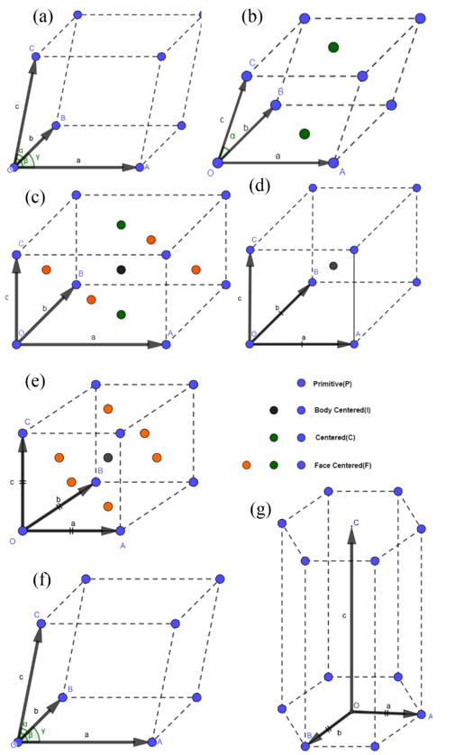
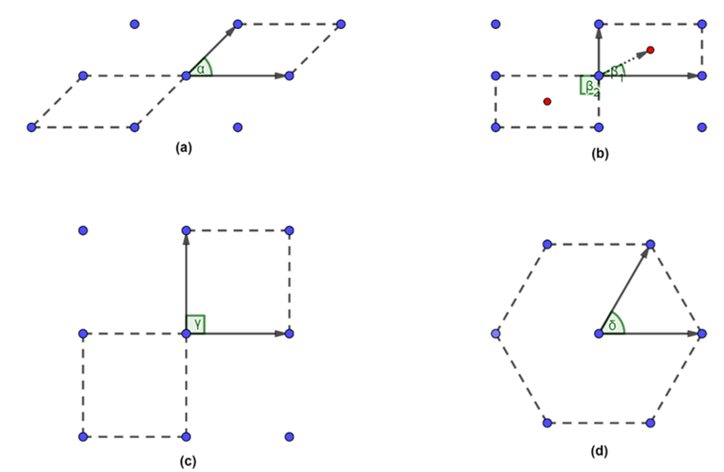
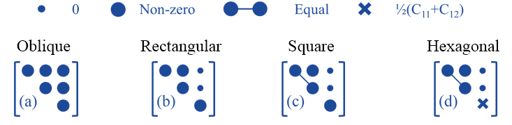

=================
Theory Background
=================

Crystal type and independent elastic constants
----------------------------------------------
* 3D crystal
The different crystal symmetry of 3D materials are illustrated in Fig. 1, and the corresponding independent elastic constants are shown in Fig. 2.

Fig. 1 Symmetry in 3D crystal

(a)Triclinic; (b)Monoclinic; (c)Orthorhombic; (d)Tetragonal; (e)Cubic; (f)Trigonal; (g)Hexagonal

.. image:: images/IndependentCIJ_3D.png
Fig. 2 The independent elastic constants in 3D crystals

* 2D crystal
The different crystal symmetry of 2D materials are illustrated in Fig. 3, and the corresponding independent elastic constants are shown in Fig. 4.

Fig. 3 Symmetry in 2D crystal

(a) Oblique; (b) Rectangular; (c) Square; (d)Hexagonal

 

Fig. 4 The independent elastic constants in 2D crystals
