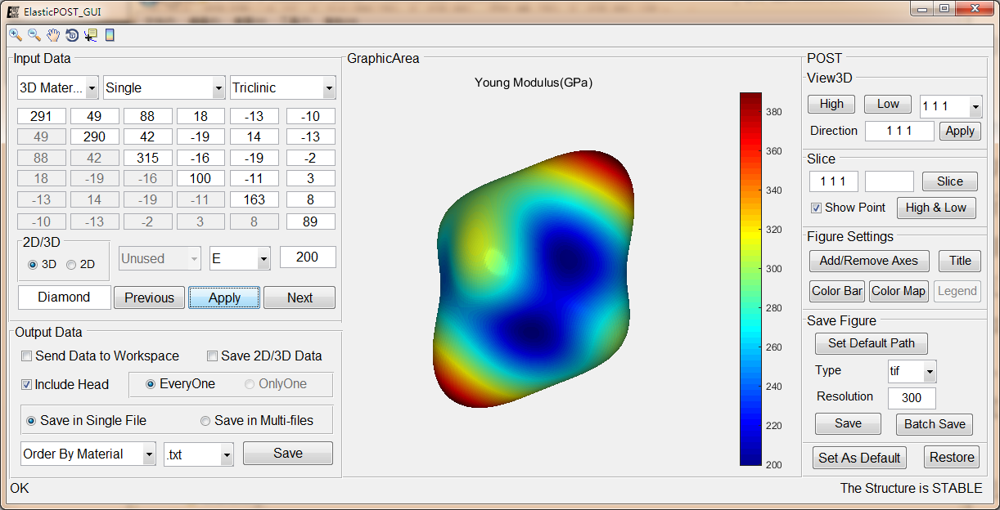

.. Read the Docs Template documentation master file, created by
   sphinx-quickstart on Tue Aug 26 14:19:49 2014.
   You can adapt this file completely to your liking, but it should at least
   contain the root `toctree` directive.

.. |logo| image:: ElasticPOST_LOGO.png
          :height: 30pt
          :width: 30pt
          :alt: Logo

|logo| ElasticPOST: POST code for Elastic constants
==============================================================================================

Contents:

.. toctree::
   :maxdepth: 2

   Introduction
   Get Started <GetStart>
   Theory Background <Theory>
   Examples
   FAQ
   API

   *
Citing
======

Author Information
==================
| Mingqing Liao(廖名情)
| liaomq1900127@163.com
| FGMS group @ Harbin Institute of Technology(HIT)

Indices and tables
==================

* :ref:`genindex`
* :ref:`modindex`
* :ref:`search`

